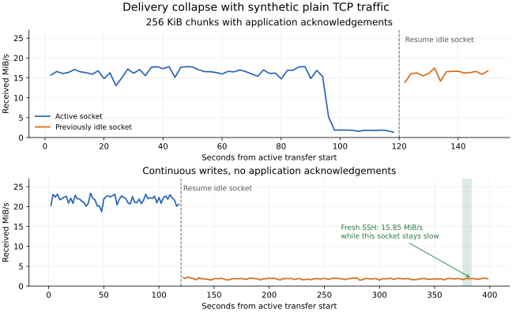

# M08 transport isolation and seek cancellation

Continuation of the [M08 follow-up](2026-09-24-m08-followup.md). The investigation
reproduced the slow seek and then reproduced the delivery collapse with synthetic
plain TCP traffic. Increasing HTTP/2 receive credit did not solve it. The
transport settings and retained-source budgets therefore remain unchanged.

## Playback reproduction

The local AIO used the candidate playback implementation; the matching NAS
mediahost additionally traced scheduler admission, positional-read duration and
outbound-channel send duration. The web player again played two minutes, sought
to 75%, and observed another two minutes after recovery. Source-demand tracing
and TCP snapshots were collected alongside the browser measurements.

Startup took 4.19 seconds. Opening playback was smooth, with delivery around
18 MiB/s. The seek took **46.47 seconds**, reproducing the original failure:
the browser ended the session at 25 seconds, the detached seek tried its fallback
after 30 seconds, and browser recovery opened a replacement session. Playback
was smooth after that replacement.

During three seconds of the slow seek, 22 chunk sends accumulated **2.980 seconds
waiting to send**. Their file reads used **8.44 ms of disk time**, and scheduler
admission **0.415 ms**. Median send wait was 142.85 ms per 256 KiB chunk, versus
0.223 ms for the positional read. The active connection delivered approximately
1.7 MiB/s. This isolates the dominant wait from disk access and scheduler admission.

A diagnostic AIO allowed 4 MiB of HTTP/2 stream credit instead of 256 KiB, leaving
connection credit, retained windows, eviction, codecs and the browser unchanged.
It also carried the cancellation fix described below. Opening delivery improved
to approximately 20–22 MiB/s, but the seek connection still fell to roughly
2 MiB/s. Its TCP RTT rose to approximately 830 ms as more data queued. The browser
gave up at 25 seconds. The larger-credit experiment was reverted; improving one
phase did not satisfy the seek requirement.

## Plain TCP controls

A small Python sender on the NAS and receiver on the local machine exchanged
synthetic bytes over two TCP sockets, with TCP_NODELAY enabled. There were no
media files, disk reads, TLS, HTTP/2, Kahawai components or GStreamer pipelines.
One socket first transferred 8 MiB and then remained idle while the other
transferred for 120 seconds. The previously idle socket then transferred 512 MiB.

Two variants were tested:

| Variant | Active connection | Previously idle connection |
|---|---|---|
| Receiver acknowledges each 256 KiB application chunk | Initially 16–17 MiB/s; falls to roughly 1.6–1.9 MiB/s late in the 120-second interval | 512 MiB in 31.72 s: 16.14 MiB/s |
| Continuous writes, no application acknowledgements | 21.72 MiB/s averaged over 120 s | 512 MiB in 279.87 s: **1.83 MiB/s** |

The continuous variant rules out both HTTP/2 and application credit updates as
necessary causes. The chunked variant shows that resuming an idle socket is not
the only trigger: a continuously active connection can enter the slow state too.
These are individual observations, not an estimate of failure probability.

During the slow continuous transfer, sender TCP snapshots showed roughly
2.3–2.7 MiB outstanding, ample advertised receive space, and no retransmissions
on that connection. The receiver was draining immediately. A separate concurrent
128 MiB SSH transfer completed in 8.07 seconds including process setup
(15.85 MiB/s), while the slow socket continued around 2 MiB/s. Thus the whole
path was not limited to 2 MiB/s of aggregate capacity.

A header-only packet capture on the local Ethernet interface measured:

- Relative to the first resumed data packet, the age of incoming NAS TCP
  timestamps grew by roughly **1.2–1.5 seconds** in steady slow intervals.
- Median local acknowledgement delay was **0.0053 ms** across 54,757 measured
  acknowledgements; the maximum was 40.95 ms.
- A contemporaneous NAS snapshot showed no software-qdisc backlog and zero NIC
  byte-queue inflight bytes. The sender had substantial unacknowledged data.

The timestamp comparison uses changes within one connection, so it does not
require synchronized host clocks. It is evidence of delayed delivery below the
application. It does **not** identify a particular switch, bridge, NIC or kernel
mechanism without further measurements. The physical path between the two wired
interfaces remains to be established. Fixing or bypassing that path should be
tested with this small reproducer before further changes to source buffering.

## Session-lifetime fix

A detached seek now observes session deletion, including during readiness and
fallback. Teardown signals cancellation and waits for the seek lock before
collecting the final run. An unpublished local run is dropped and kills its
worker; queued seeks on an ended session never start. An HTTP disconnect alone
continues to leave an accepted seek running.

The failing larger-credit playback trial verified immediate cancellation at the
browser's 25-second deletion, with no later fallback. A separate live check used
the original 256 KiB credit and deliberately stopped replacement workers:

1. Disconnect the HTTP seek request. The worker survives; after it is resumed,
   it produces output at the requested deep position.
2. Start another seek, stop its worker during readiness, then delete the session.
   DELETE completes in 1.4 ms, the seek returns an error, and no worker remains.
   No replacement appears during the following 32 seconds.

Unit regressions cover cancellation before a queued restart is polled and dropping
an in-flight restart without reaching fallback. `scripts/kahawai-playback.sh pull`
includes them. Source-stream TRACE events now distinguish admission, disk and
outbound-channel waiting for future investigations.

## Evidence and limits

Private evidence is retained under
`target/benchmarks/2026-09-24-m08-solution/`: instrumented playback, the rejected
credit experiment, both synthetic controls, TCP snapshots, the packet capture,
its timing analysis, and live cancellation results. Source identities appear only
in the private artifacts. The synthetic transfer scripts use no credentials
beyond the existing SSH invocation; API helpers consume authentication internally.

The byte-delivery problem is reproduced and isolated below the application, but
its exact network/OS cause is not yet resolved. The cancellation fix limits
wasted work; it does not make a 2 MiB/s connection sustain this source. The
benchmark's intermittent transport conditions also limit conclusions about the
relative throughput of push and pull implementations from one run per condition.

Validation passed: the strict GStreamer workspace suite (789 passed, 10 ignored),
`cargo clippy --workspace --all-targets`, release builds for AIO and mediahost,
formatting and the OpenAPI fingerprint check. Original local AIO and NAS
mediahost binaries were restored and verified by SHA-256. Both local and Mac
mini hubs report the NAS healthy, with no diagnostic sessions left. The Mac
mini executable was unchanged. The fix is validated locally, not rolled out.
