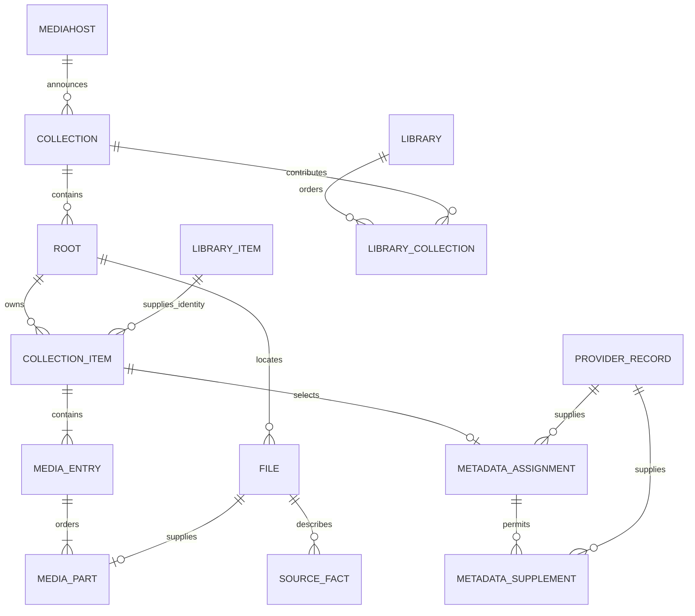

# Media database

`kahawai-mediadb` is Kahawai's independent media catalogue and metadata storage
crate. It opens an explicit database path; examples use `mediadb.db`. It has no dependency on the
current hub, and does not connect satellites, fetch providers, expose HTTP,
play media, or implement watch history. The current hub continues to own its
existing database and interfaces.

The hub database owns users, credentials, watch status and other user state.
Mediadb owns a separate file and a separate migration history; it never attaches
or migrates the hub database. Integration with the hub remains future work.

Schema meaning lives in the Rust module documentation beside the enforcing
operations. Numbered, append-only SQL migrations live in
`crates/kahawai-mediadb/migrations/`; `0001_media_catalogue.sql` is the current
catalogue schema. SQLx embeds them at build time and records their versions,
checksums and completion in this database's `_sqlx_migrations` table. There is no
second schema-version table.

`Store::create` requires a nonexistent path. `Store::open` first checks the initial
migration's recorded checksum through a read-only connection, so an accidental
hub/foreign database path cannot bootstrap media tables or modify its history.
Both entry points run pending migrations on the serialized writer before exposing
the Store. SQLx rejects changed applied migrations and unknown applied versions;
each migration's schema/data changes and success record commit together. Failed
upgrades leave earlier committed migrations intact and can be retried on open.
There is one serialized writer and three query-only readers, using the existing
`kahawai-sqlite` implementation without custom cache tuning.

The earlier disposable mediadb databases predate this migration history and must
be discarded and recreated once. They are not silently adopted or relabelled. From
this baseline onward, add `0002_description.sql`, then subsequent numbered files;
never edit an applied migration or its recorded checksum. Keep schema semantics in
Rust documentation. The crate's build script watches the migrations directory so
adding a file rebuilds the embedded migration set. Deployments must run a rebuilt
binary to apply new migrations.

## Ownership and composition



A collection item is a physical occurrence of a top-level movie, series/anime
or album. Different roots, title directories and movie renditions remain
independently assignable. CD1/CD2 form the ordered parts of one physical movie;
release punctuation, case, directories and roots remain in that physical key.
There is no inferred total part count: a lone CD2 remains ordinal 2, not a
complete movie manufactured from other copies. Duplicate part ordinals are
rejected transactionally.

A media entry is a physical movie rendition, episode file/combined episode
coverage, or music track. Episodes preserve native season/absolute numbering and inclusive spans without
expanding combined ranges into arbitrarily large row sets;
tracks preserve disc/track position and recording Artist independently of Album
Artist. Media entries are not independent provider-assignment targets.

Automatic import reuses the core filename/tag parsers. Series/album directories
are occurrence boundaries, with structural Season/CD/disc directories beneath
them. A flat series uses its detected title as its directory-free occurrence;
a flat tagged album uses its exact artist/album tags. Unparseable files retain
source facts and a mapping diagnostic. `put_occurrence` supplies an explicit,
sticky mapping for layouts the automatic resolver cannot identify. It adds or
replaces named entries and keeps unmentioned entries. Changes remain scoped to
one root; media bytes are never opened or modified.

## Metadata and library grouping

A provider record is stored once per provider, namespace, external ID and
language. Its scalar title/year describe identity; its typed description holds
optional descriptive fields, including child descriptions. An assignment chooses
one record for a collection item. Anime may also use movie/series records from
western providers. Supplements are explicitly associated evidence for that
assignment, with at most one answer per provider; title similarity does not
establish such an association.

The selected provider wins each descriptive field. Supplements fill absent
fields in configurable per-media-type order. An explicit empty list is an
answer. Each resolved field names its source record. Changing the selected
identity removes its supplemental associations but retains stored provider
records; reassigning the same record is a no-op. Default fallback orders follow
the current documented provider lists; this crate performs no provider traffic.

Libraries contain ordered, same-typed collections. Library items are persistent,
global identities within a media type. Every collection item holds one non-null
library-item reference. Matching uses selected title/year, or detected title/year
when unassigned; both components come from the same identity source. Titles use
NFC, lowercase and whitespace normalization; punctuation and accents distinguish
keys. Normalized keys are stored only on library items.

Movies, series and anime with complete title/year coalesce. Albums and incomplete
identities additionally include their collection-item ID as a discriminator. Thus
equal albums never coalesce, and missing values never act as wildcards. Uniqueness
covers missing years as well as known years. The discriminator is retained identity
data, not a foreign key to a collection item that may later disappear.

Library-item IDs and matching fields never change. Correcting one Matrix copy to
Dark City moves its reference to the existing Dark City item or creates that item.
The Matrix ID remains, and correcting the copy back reuses it. Album corrections
work the same way within that occurrence: changing title/year moves to a different
item; other physical albums remain independent. Provider-record identity changes
move all primary-assigned copies transactionally; supplements never set identity.

An item is archived exactly when no collection items reference it. There is no
stored flag, copy count, archive table, cleanup worker or restore operation.
Deleting a collection/library/mediahost never deletes library identities. Removing
a library's membership merely hides copies from that library; it does not archive
an item while any collection item still refers to it. A temporarily disconnected
mediahost likewise does not imply deletion.

Deleted copies' metadata assignments are not restored. A returning copy uses its
current detected or selected identity and can reuse an archived matching item.
A fresh album or incomplete-title occurrence gets a new collection-item ID and
therefore a new library ID, even if its path is the same. No historical source-path
matching is performed. Provider records remain reusable evidence.

`LibraryItem.id` replaces the former `GroupKey`, and `CollectionItem.library_item_id`
exposes its membership. `library_item(library, item_id)` returns an item with copies
accessible in that library; `library_item_record(item_id)` returns its durable ID,
media type, original readable identity label/year and computed `archived` state,
even without copies. It stores no resolved-description snapshot. Watch history is
not implemented by this increment.

Browse uses an indexed existence check for copies in the requested library, then
loads that page's copies by foreign key, without query-time grouping. The first
assigned copy in collection order supplies the description, otherwise the first
detected copy does; stable collection-item IDs break ties. Supplements are resolved
within that copy. Global IDs do not leak descriptions from inaccessible copies.
All page reads share a database snapshot.

Committed occurrences always contain a probed source through their media entries.
Creation validates parts, and deletion/reconciliation prunes empty entries and
occurrences. The last copy's removal naturally leaves its library item archived;
no additional deletion logic is needed.

The complexity reduction is one authoritative membership link replacing derived
group keys, two grouping views, duplicated normalized-title columns and separate
assigned/detected browse paths. One identity allocation operation handles writes;
there are no ID merges, redirects, background reconciliation or archive transitions.

The cost criterion remains 200 ms per browse page at 50k active titles and 250k
files, now checked with another 50k archived identities interleaved in title order.
Identity edits add indexed lookups/writes for affected copies, rather than repeated
browse-time grouping or global regrouping. Retained rows are durable identity state,
not a rebuildable cache. Archival checks require only indexed local reads, with no
provider requests, media reads, stored archive flag or eviction policy.

## Catalogue import and checks

`offer_collection` accepts the existing protocol collection declaration and
returns its hub ID and durable cursor. `apply_catalogue` consumes protocol-4
chunks and returns an ACK only after the final chunk commits. Exact source
addresses, payload ownership, versions, epochs and snapshot state are validated.
File records and all current discovery record kinds are retained. Unknown future
kinds reject the whole chunk rather than advancing past unconsumed data.

Snapshot attempts have durable generations. An interrupted snapshot keeps its
old unseen files; a fresh offer restarts the attempt, and only final commit
removes records absent from that generation. Record versions need not be ordered
inside a file-first snapshot. The final cursor must cover every prior chunk.
Incremental replay skips already-committed versions. File replacement removes
facts for the old physical revision; malformed/stale fact batches roll back.
Unchanged occurrences retain their IDs and assignments. Removing a namespace
removes its projection and assignments; its now-unreferenced library items remain
archived. Live connection availability is later hub runtime work.

Run:

```sh
scripts/kahawai-mediadb.sh check
scripts/kahawai-mediadb.sh scale
scripts/kahawai-mediadb.sh create /path/to/mediadb.db
scripts/kahawai-mediadb.sh migrate /path/to/mediadb.db
```

`check` runs crate tests, including pending upgrades, repeat opens, failed migration
rollback/retry and rejection of foreign/newer/modified histories. Its separate-process
on-disk seed/migrate/reopen proof checks applied versions and checksums alongside
actual catalogue rows and public operations. It records the original IDs,
deletes the collection, verifies the archived rows in another process, reimports
current identities, and verifies resurrection without restoring deleted assignments.
`scale` uses an optimized release build and directly seeds a synthetic
50k-active-title/250k-file fixture with half the titles provider-assigned plus 50k
archived items. It gates first, middle and last 100-result pages on the browse
target. It measures database browsing, not end-to-end HTTP latency or mediahost
ingestion throughput.

`create` initializes an empty media database; `migrate` opens an existing one and
applies pending migrations. Both print the verified migration version and leave the
hub database alone. Relative paths are resolved from the caller's working directory.
