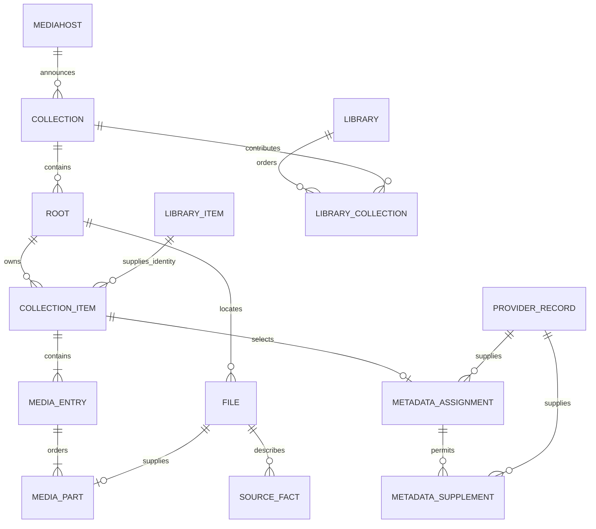

# Media database

`kahawai-mediadb` is Kahawai's independent media catalogue and metadata storage
crate. It opens an explicit database path; examples use `mediadb.db`. It has no dependency on the
current hub, and does not connect satellites, fetch providers, expose HTTP,
play media, or implement watch history. The current hub continues to own its
user/operational database and exposes the catalogue APIs described below.

The hub database owns users, credentials, watch status and other user state.
Mediadb owns a separate file and a separate migration history; it never attaches
or migrates the hub database. Mediahost ingestion now uses Store in the hub;
provider execution, the existing viewer UI and playback source selection use it as well.
User state and the media engine remain in the hub.

Schema meaning lives in the Rust module documentation beside the enforcing
operations. Numbered, append-only SQL migrations live in
`crates/kahawai-mediadb/migrations/`; `0001_media_catalogue.sql` establishes the catalogue and
`0002_enrichment.sql` adds durable enrichment; `0003_downloaded_subtitles.sql` adds source-owned subtitle assets. `0004_media_entry_episodes.sql` renames the physical episode coverage table from
`entry_episodes` to `media_entry_episodes`. SQLx embeds them at build time and records their versions,
checksums and completion in this database's `_sqlx_migrations` table. There is no
second schema-version table.

`Store::create` requires a nonexistent path. `Store::open` first checks the initial
migration's recorded checksum through a read-only connection, so an accidental
hub/foreign database path cannot bootstrap media tables or modify its history.
Both entry points run pending migrations on the serialized writer before exposing
the Store. SQLx rejects changed applied migrations and unknown applied versions;
each migration's schema/data changes and success record commit together. Failed
upgrades leave earlier committed migrations intact and can be retried on open.
There is one serialized writer and three query-only readers, using the existing
`kahawai-sqlite` implementation without custom cache tuning.

The earlier disposable mediadb databases predate this migration history and must
be discarded and recreated once. They are not silently adopted or relabelled. From
this baseline onward, add subsequent numbered migration files;
never edit an applied migration or its recorded checksum. Keep schema semantics in
Rust documentation. The crate's build script watches the migrations directory so
adding a file rebuilds the embedded migration set. Deployments must run a rebuilt
binary to apply new migrations.

## Ownership and composition



A collection item is a physical occurrence of a top-level movie, series/anime
or album. Different roots, title directories and movie renditions remain
independently assignable. CD1/CD2 form the ordered parts of one physical movie;
release punctuation, case, directories and roots remain in that physical key.
There is no inferred total part count: a lone CD2 remains ordinal 2, not a
complete movie manufactured from other copies. Duplicate part ordinals are
rejected transactionally.

A media entry is a physical movie rendition, episode file/combined episode
coverage, or music track. Episodes preserve native season/absolute numbering and inclusive spans without
expanding combined ranges into arbitrarily large row sets;
tracks preserve disc/track position and recording Artist independently of Album
Artist. Media entries are not independent provider-assignment targets.

Automatic import reuses the core filename/tag parsers. Series/album directories
are occurrence boundaries, with structural Season/CD/disc directories beneath
them. A flat series uses its detected title as its directory-free occurrence;
a flat tagged album uses its exact artist/album tags. Unparseable files retain
source facts and a mapping diagnostic. `put_occurrence` supplies an explicit,
sticky mapping for layouts the automatic resolver cannot identify. It adds or
replaces named entries and keeps unmentioned entries. Changes remain scoped to
one root; media bytes are never opened or modified.

## Episode and track identities

Child identities name physical positions beneath a stable library item. Mediadb
derives versioned IDs from the parent and native season/episode, absolute episode,
or disc/track position. Absolute and seasonal numbering remain distinct; an unknown
disc is not disc 1. An unnumbered track uses its disc and physical media-entry ID
as a discriminator. The wire encoding belongs to mediadb; clients treat it as opaque.

There are no child identity tables or synchronization writes. Only positions with
accessible physical sources are listed. Provider descriptions supply fields by
position, never create missing episodes/tracks, and never assign IDs through list
indices. A combined file supplies several child positions without splitting the
file, copying parts, or inventing individual durations. Multiple physical renditions
of a position are alternatives. Albums keep their existing independent identities.

Numbered IDs survive metadata reordering, source replacement and process restart.
Correcting the parent or position moves the source to another key; restoring that
key restores its ID. Removing the last accessible source makes detail return 404.
An unnumbered track's discriminator lasts only as long as its physical entry.

Child queries share a read snapshot, resolve descriptions within accessible copies,
and use the existing assigned-copy/collection precedence among copies supplying
the child. Ambiguous descriptions fall back to physical titles and numbering.
Compact coverage intervals provide exact counts and bounded pages without expanding
large episode ranges.

The catalogue exposes paged children at
`GET /api/v1/catalogue/libraries/{library}/items/{parent}/children`, with
`offset`, `limit` (1–200, default 200), optional `season` (number or
`absolute`), or `disc` (number or `unknown`). Responses contain total and
native group counts. The existing item-detail and artwork routes accept child IDs;
details retain ordered file parts and expose their stable `media_entry_id`.
The old `:description:<index>` addresses are retired without guessing redirects.
Use `scripts/kahawai-mediadb.sh api children LIBRARY PARENT` and the existing
`api item LIBRARY CHILD` command to inspect them.

The existing episode/season/album layouts use these responses and load additional
pages incrementally. Playback and watch-state operations remain disconnected.
No migration or rewriting of existing media or user state is required.

## Metadata and library grouping

A provider record is stored once per provider, namespace, external ID and
language. Its scalar title/year describe identity; its typed description holds
optional descriptive fields, including child descriptions. An assignment chooses
one record for a collection item. Anime may also use movie/series records from
western providers. Supplements are explicitly associated evidence for that
assignment, with at most one answer per provider; title similarity does not
establish such an association.

The selected provider wins each descriptive field. Supplements fill absent
fields in configurable per-media-type order. An explicit empty list is an
answer. Each resolved field names its source record. Changing the selected
identity removes its supplemental associations but retains stored provider
records; reassigning the same record is a no-op. Default fallback orders follow
the current documented provider lists; this crate performs no provider traffic.

Libraries contain ordered, same-typed collections. Library items are persistent,
global identities within a media type. Every collection item holds one non-null
library-item reference. Matching uses selected title/year, or detected title/year
when unassigned; both components come from the same identity source. Titles use
NFC, lowercase and whitespace normalization; punctuation and accents distinguish
keys. Normalized keys are stored only on library items.

Movies, series and anime with complete title/year coalesce. Albums and incomplete
identities additionally include their collection-item ID as a discriminator. Thus
equal albums never coalesce, and missing values never act as wildcards. Uniqueness
covers missing years as well as known years. The discriminator is retained identity
data, not a foreign key to a collection item that may later disappear.

Library-item IDs and matching fields never change. Correcting one Matrix copy to
Dark City moves its reference to the existing Dark City item or creates that item.
The Matrix ID remains, and correcting the copy back reuses it. Album corrections
work the same way within that occurrence: changing title/year moves to a different
item; other physical albums remain independent. Provider-record identity changes
move all primary-assigned copies transactionally; supplements never set identity.

An item is archived exactly when no collection items reference it. There is no
stored flag, copy count, archive table, cleanup worker or restore operation.
Deleting a collection/library/mediahost never deletes library identities. Removing
a library's membership merely hides copies from that library; it does not archive
an item while any collection item still refers to it. A temporarily disconnected
mediahost likewise does not imply deletion.

Deleted copies' metadata assignments are not restored. A returning copy uses its
current detected or selected identity and can reuse an archived matching item.
A fresh album or incomplete-title occurrence gets a new collection-item ID and
therefore a new library ID, even if its path is the same. No historical source-path
matching is performed. Provider records remain reusable evidence.

`LibraryItem.id` replaces the former `GroupKey`, and `CollectionItem.library_item_id`
exposes its membership. `library_item(library, item_id)` returns an item with copies
accessible in that library; `library_item_record(item_id)` returns its durable ID,
media type, original readable identity label/year and computed `archived` state,
even without copies. It stores no resolved-description snapshot. Watch history lives separately in the hub database.

Browse uses an indexed existence check for copies in the requested library, then
loads that page's copies by foreign key, without query-time grouping. The first
assigned copy in collection order supplies the description, otherwise the first
detected copy does; stable collection-item IDs break ties. Supplements are resolved
within that copy. Global IDs do not leak descriptions from inaccessible copies.
All page reads share a database snapshot.

Committed occurrences always contain a probed source through their media entries.
Creation validates parts, and deletion/reconciliation prunes empty entries and
occurrences. The last copy's removal naturally leaves its library item archived;
no additional deletion logic is needed.

The complexity reduction is one authoritative membership link replacing derived
group keys, two grouping views, duplicated normalized-title columns and separate
assigned/detected browse paths. One identity allocation operation handles writes;
there are no ID merges, redirects, background reconciliation or archive transitions.

The cost criterion remains 200 ms per browse page at 50k active titles and 250k
files, now checked with another 50k archived identities interleaved in title order.
Identity edits add indexed lookups/writes for affected copies, rather than repeated
browse-time grouping or global regrouping. Retained rows are durable identity state,
not a rebuildable cache. Archival checks require only indexed local reads, with no
provider requests, media reads, stored archive flag or eviction policy.

## Catalogue import and checks

`offer_collection` accepts the existing protocol collection declaration and
returns its hub ID and durable cursor. `apply_catalogue` consumes protocol-4
chunks and returns an ACK only after the final chunk commits. Exact source
addresses, payload ownership, versions, epochs and snapshot state are validated.
File records and all current discovery record kinds are retained. Unknown future
kinds reject the whole chunk rather than advancing past unconsumed data.

Snapshot attempts have durable generations. Protocol 4 marks only the first
message with `snapshot=true`; persisted attempt state covers continuation pages
until the final `done` commits. An interrupted snapshot keeps its
old unseen files; a fresh offer restarts the attempt, and only final commit
removes records absent from that generation. Record versions need not be ordered
inside a file-first snapshot. The final cursor must cover every prior chunk.
Incremental replay skips already-committed versions. File replacement removes
facts for the old physical revision; malformed/stale fact batches roll back.
Unchanged occurrences retain their IDs and assignments. Removing a namespace
removes its projection and assignments; its now-unreferenced library items remain
archived. Live connection availability is supplied by the hub registry, independently of catalogue persistence.

Run:

```sh
scripts/kahawai-mediadb.sh check
scripts/kahawai-mediadb.sh scale
scripts/kahawai-mediadb.sh create /path/to/mediadb.db
scripts/kahawai-mediadb.sh migrate /path/to/mediadb.db
```

`check` runs crate tests, including pending upgrades, repeat opens, failed migration
rollback/retry and rejection of foreign/newer/modified histories. Its separate-process
on-disk seed/migrate/reopen proof checks applied versions and checksums alongside
actual catalogue rows and public operations. It records the original IDs,
deletes the collection, verifies the archived rows in another process, reimports
current identities, and verifies resurrection without restoring deleted assignments.
`scale` uses an optimized release build and directly seeds a synthetic
50k-active-title/250k-file fixture with half the titles provider-assigned plus 50k
archived items. It gates first, middle and last 100-result pages on the browse
target. It measures database browsing, not end-to-end HTTP latency or mediahost
ingestion throughput.

`create` initializes an empty media database; `migrate` opens an existing one and
applies pending migrations. Both print the verified migration version and leave the
hub database alone. Relative paths are resolved from the caller's working directory.


## Hub ingestion milestone

The `mediadb` branch opens `mediadb.db` beside `hub.db` before serving listeners.
Mediadb is the sole active catalogue owner. Complete mediahost offers update roots,
cursors and retained collections atomically; omitted collections are removed only
by a valid committed offer. Network and in-process links share the same handler.
The hub validates root-token bindings and serializes registration, ingestion and
host deletion by connection generation. Store commits precede cursor/ACK replies.
Disconnects preserve data. Host deletion removes the media catalogue before
revoking enrollment, so an interruption can be recovered by an enrolled host's
reimport without an outbox or distributed transaction.

Users, enrollment, credentials and old watch history stay in `hub.db`. Old catalogue
rows remain inert so their history references remain valid. Existing library setup,
provider assignments and watch history are not converted; remapping history is not
a required follow-up. A new media database starts with no libraries. The hub's
migration 87 detaches grants from its old libraries table while retaining the user
foreign key and existing grant rows. New grants are validated against Store;
nonexistent library IDs grant nothing. Admins and unrestricted users retain their
existing bypass, and inaccessible libraries/items return 404.

The admin UI composes libraries from imported collections; the same operations
are available through the API companion. Authenticated catalogue endpoints are:

- `GET /admin/v1/catalogue/collections`: imported namespaces, roots, file counts,
  durable cursor/snapshot state and current connection/scan status.
- `POST /admin/v1/catalogue/libraries`: `{name, media_type, collection_ids}`.
- `PUT /admin/v1/catalogue/libraries/{id}/collections`: ordered `{collection_ids}`.
- `DELETE /admin/v1/catalogue/libraries/{id}`.
- `GET /api/v1/catalogue/libraries`: accessible libraries.
- `GET /api/v1/catalogue/libraries/{id}/items`: pages with `offset`, `limit`, exact `total`, title filter `q`,
  `sort` (`title`, `year`, `added`, optionally descending with `-`) and optional
  artist filter (default limit 200, cap 1,000; zero is rejected).
- `GET /api/v1/catalogue/libraries/{id}/artists`: paged album artist groups.
- `GET /api/v1/catalogue/libraries/{id}/items/{item_id}/artwork` and
  `/api/v1/catalogue/libraries/{id}/artists/{key}/artwork`: scoped viewer artwork.
- `GET /api/v1/catalogue/libraries/{id}/items/{item_id}`: the scoped identity,
  accessible copy IDs and resolved metadata, plus detail-only copies, grouped
  physical sources, stream summaries, representative runtime and chapters.

Library IDs from this API can be granted through the existing user administration
endpoint. All catalogue, playback, watch-state and source-artifact consumers
use mediadb. Retired browse/matching/artwork/subtitle routes are absent and return
404. Hub migration 0089 drops their unused catalogue and historical watch tables,
views and triggers. Current accounts, grants, credentials and watch state remain;
paid on-disk artifacts and the still-consumed AniDB hash-answer cache are retained.
There is no separate compatibility router or legacy ingestion implementation.
Backup/restore snapshots both databases and validates both before replacing either.

```sh
scripts/kahawai-mediadb.sh api login USERNAME
# Set KAHAWAI_TOKEN to the returned access token; KAHAWAI_URL defaults to loopback.
scripts/kahawai-mediadb.sh api collections
scripts/kahawai-mediadb.sh api create-library Movies movies COLLECTION_ID
scripts/kahawai-mediadb.sh api libraries
scripts/kahawai-mediadb.sh api items LIBRARY_ID
scripts/kahawai-mediadb.sh check-live
```

`check-live` builds the binary and runs isolated hub and actual mediahost processes
against generated fixture media. It checks two-copy coalescing, committed rows in
both databases, crash/restart and replay, file tombstones, host deletion/archival,
and the in-process mediahost. It uses temporary profiles and only stops its own
child PIDs; the normal development service is not restarted.


### Admin library composition

Admin → Libraries creates a named, typed library with an optional ordered selection
of imported collections. Edit collections keeps a local draft until Save collections;
Cancel discards it. Only matching media types are offered. Selected collections can
be moved earlier or later, controlling the existing representative priority. Polling
updates collection availability without replacing a draft. Missing collections must
be removed before saving, and failed saves retain the draft for retry. Empty
libraries are valid. Host names, roots, file counts and scan/offline status identify
the inputs, including the in-process host.

Deleting a library requires confirmation, revokes its grants and retains imported
collections. The Users & grants panel reads the same media library IDs. The API
has no membership revision token: Save
replaces the ordered set, and simultaneous administrators use last successful write.

Run `scripts/kahawai-mediadb-ui.sh` for browser acceptance against an isolated hub
and actual mediahost. It checks creation, cancellation, detach/reattach, reload
persistence, grants/deletion, accessibility and narrow-screen layout, then completes
the ingestion restart/replay checks. Unit tests cover ordered multi-collection
membership, failures, polling, missing inputs and duplicate submissions.


### Enrichment on mediadb

The hub runs independent persistent work lanes for local NFO/tags, TMDB, TVDB,
AniDB, AniList, MusicBrainz, identity mappings, and artwork. Only collections in a
library are eligible. Credentials and provider clients stay in the hub; mediadb
owns answers, candidates, assignments, verified links, artist identities and work
state. The Rust module docs in `kahawai-mediadb/src/enrichment.rs` define the schema
semantics. Migration 2 adds this state independently of the hub database.

A provider failure releases its claim and records a retry or credential block.
It cannot stop other providers, local metadata or cached work. Whole attempts have
a timeout; expired leases recover after a crash. Completed episode pages survive
an interrupted attempt. Existing HTTP gates, AniDB ban persistence and cache
retention still apply. Errors are not cached as misses. Artist identity lookups,
artist image providers, cover downloads and collage generation run independently:
only work requiring a missing answer waits for that answer.

Confident candidates can select an identity. Weak suggestions require review;
rejections survive retries and manual pins win. Local sidecars may supply fields
without claiming an identity. Provider order chooses future automatic matches and
supplement precedence; changing it never replaces an existing selected identity.
Supplemental records require a verified provider ID link or an explicit admin
association. Children remain descriptions of the selected parent; physical file
coverage stays in media entries. Corrections invalidate captured work and rebind
the affected copy to a stable library item in the same transaction.

Admin → Providers configures credentials and order. Matching opens on a library
card or an individual source, using the original per-item screen: file identity,
copy selector, confirmation/rejection, search and poster candidates,
and existing library identities. There is no Enrichment admin tab or manual
title/year creation. Search queries the configured providers for the media type
concurrently and retains successful results when another provider fails.
Choosing a saved identity selects its metadata for this copy.
Stable grouping still applies, including album
separation. Episodes remain part of their series occurrence, not independent
identity assignments.

Mutations carry the displayed input revision and reject stale edits with HTTP
409. Candidate posters use a same-origin image endpoint accepting administrator
bearer or media-cookie credentials; writes still require a bearer token. The
generated client uses the hub's OpenAPI document. `scripts/kahawai-enrich.sh`
provides progress, search, saved-identity lookup, correction and retry commands;
`scripts/kahawai-enrich.sh check` runs the queue and runtime checks.

Content-keyed legacy AniDB hash answers are imported once, without associating
old per-copy assignments or history. Remaining viewer features, playback, watch-state, subtitles,
segment detection and backup cutovers remain separate work.


### Viewer library navigation

The original home shelves, virtual poster grids, artist grids and detail components
consume catalogue data through a presentation adapter. Item and artist pages are
filtered, sorted and counted in mediadb; only the requested page is described.
Artwork is served through a library-scoped viewer endpoint with the same access
checks as item details. Album identities remain separate. Composition changes
invalidate the shell and view queries. Watch-state shelves and playback use stable library/child identities; old history
is not remapped and is removed by migration 0089.

## User watch state

The hub owns `catalogue_watch_state`, keyed by `(user_id, item_id)`, with the
stable mediadb parent ID recorded alongside child IDs. There is no library ID in
that key: the same identity exposed by multiple libraries shares user state.
There is no FK into mediadb and no automatic history deletion when sources or
libraries disappear. User deletion cascades. Legacy watch history stays separate.
Schema semantics and write rules live in `kahawai-hub/src/watch.rs`.

Catalogue lists, children and details include the current user's state. Watched
season totals count only accessible physical children, including rows beyond the
current page. `PUT /api/v1/catalogue/libraries/{library}/items/{item}/watched`
takes `{ "played": true }`, optional explicit child `items`, or a native `season`
(number as a string, or `"absolute"`). A batch validates all IDs before writing
and is atomic, limited to 2000 items. Manual marks clear resume position.
`scripts/kahawai-mediadb.sh api watched LIBRARY ITEM [--unwatched] [--season N]`
provides the same operation from the CLI.

Completion is a boolean; the seen counter is removed from presentation and API,
and session teardown no longer counts plays. Historical columns are preserved.
Progress storage accepts stable movie/episode/track identities; tracks retain
completion without resume offsets. Catalogue playback reports these stable identities directly; old resume positions
are not imported.

## Home watch feeds

`GET /api/v1/catalogue/continue-watching` and `/api/v1/catalogue/up-next`
read the signed-in user's new hub watch state. Both accept optional `library`,
`offset`, and `limit` (default 12, maximum 200), return exact totals, deduplicate
identities across libraries and link through a currently permitted library.
Removed sources disappear from these rows; their watch history remains intact.

Continue watching contains physically present movies and episodes with unfinished
progress of at least one minute and 1% of a known runtime. With unknown runtime,
the one-minute threshold applies. Tracks and albums are excluded. Up next picks
the first physical, unwatched episode after the last episode finished, using
native coordinates; batch ties choose the highest position and earlier gaps are
skipped. Meaningful visible progress suppresses that series from Up next.
The existing 30-day recency rule uses either last completion or arrival of the
next episode's oldest surviving physical rendition. Derived child IDs are not
arrival timestamps. The rules live in `api/catalogue/feeds.rs`.

Queries start from one user's history, not a scan of every library item. Physical
next-episode lookup walks coverage intervals without expanding combined files.
No copied catalogue, cache, migration or background sync is introduced.
`scripts/kahawai-mediadb.sh api continue-watching` and `api up-next` exercise the
same endpoints. The existing home-screen layout consumes both feeds, populated
by catalogue playback progress.


## Playback through mediadb

Library items expose a derived `kind` (`movie`, `series`, `album`) separately
from their collection `media_type`. Anime is a category containing movies and
series: visible episode entries make an anime item a series, otherwise it is a
movie. Browsing, playback and Continue watching share this distinction.

`Store::playback_item(library, item)` reads current membership, child coverage,
whole renditions and exact physical addresses in one transaction. It never writes
hub catalogue rows. Discovery facts supply geometry, keyframe intervals and
attachments to the returned probe. The hub applies current connection state and
its existing codec/capability negotiation, cost ordering, user limits and execution
placement. Direct byte ranges, HLS remux/transcoding, seeking, track switches,
recovery and the audio queue use the existing engine.

`POST /api/v1/catalogue/libraries/{library}/items/{item}` takes the playback
profile and returns detail with negotiation. `POST /api/v1/playback/sessions`
requires `library_id` and a stable movie/episode/track `item_id`; optional
`media_entry_id` pins a rendition. The old numeric source groups remain local to
presentation, and the player translates selections to the stable rendition ID.
Only sources inside the requested, permitted library are eligible.

A session captures physical parts, streams, item identity and episode coverage.
Rematching a copy cannot redirect its progress. Progress writes the hub's
`catalogue_watch_state`; session teardown never increments a counter. Resume is
item-owned; automatic recovery additionally requires the captured physical
fingerprint. Movies/episodes retain positions, tracks retain only completion.
A combined file has one timeline: unfinished progress belongs to the opened
episode, and completion marks its contained episodes together. No episode offsets
are invented. Coverage must fit the existing 2000-item atomic watch-operation
bound. Player handover skips the selected rendition's covered episodes.

Embedded and sidecar subtitle tracks are read from the captured probe, with
session-scoped text/ASS, fonts and bitmap taps. Mediahost extraction replies again
reach the cache, through current connection generations and mediadb source checks.
Skip markers are captured from the selected rendition's source observations and
named chapters. They are file-version data (host/collection/root/path, size,
mtime and detector generation), never metadata attached to a library item.
Multipart offsets are added to each file's own timestamps. Preview markers
belong to its negotiated rendition; the session response supplies the definitive
list, including an explicit empty list when that release has no markers.
Changing releases or recovering a session replaces that list; rematching metadata
does not change an active session's captured timestamps. No segment rows are
copied into the hub database. The optional community lookup runs in the browser using the representative
copy's selected or verified-linked TMDB/TVDB identity, with the existing
preference, release-duration matching and measured-marker precedence.

Source-owned loudness observations are read from mediadb. Downloaded subtitles
commit their metadata and text together in mediadb, bound to a media entry and
its ordered file-version fingerprint (file IDs, size, mtime and content hashes).
They remain with that rendition through metadata rematches, never another release;
replacement media hides the old asset without discarding it. Multipart downloads
belong to the complete rendition timeline. Search hashes only single-file sources,
then falls back to provider identity and title. A stale source/version is rejected
before download; a source change during download retains the completed asset under
its original version. Concurrent repeat requests reuse the existing provider file.
Sessions capture the downloaded text, so deletion cannot redirect an active player.
Only its creator or an administrator can delete an asset; library grants apply to
search, download and deletion. Hub-owned OpenSubtitles credentials and provider
traffic handling are reused. The existing detail panel uses library-scoped
`subtitles/search`, `subtitles/download` and `subtitles/{track}` routes with the
preview's `subtitle_source`. `api subtitle-search|subtitle-download|subtitle-delete`
in the companion script accepts that entry ID and version explicitly.
OCR and rasterised ASS keep using the hub's retained subtitle cache. Physical
revision/parent-track keys replace their dependency on legacy subtitle row IDs;
mediadb remains the source of file identities and probes. OCR runs during idle
periods, remembers empty answers on disk, and retries disconnected hosts when
links return. Rasterisation runs only when the ASS ladder needs it. Publication
is atomic and continues after a session's bounded wait expires. Playback lists
and captures these artifacts with their parent tracks; raster URLs are session
resources and OCR uses the existing text-serving path. No generated-track table
or schema migration is needed. Backup includes both databases, preserving these
downloads and metadata alongside hub users and watch state. Snapshots are online
and sequential, not a cross-database transaction; stop the hub first when a
quiescent snapshot is needed. Restore requires a stopped hub. Older hub-only
snapshots remain readable into a fresh directory, but cannot overwrite an
existing mediadb with an unrelated hub database.

CLI: `scripts/kahawai-play.sh -l LIBRARY [-e MEDIA_ENTRY] USER PASSWORD ITEM`, or
`kahawai-mediadb.sh api playback|start LIBRARY ITEM`, `api progress SESSION MS`
and `api stop SESSION`. The isolated live check exercises real remote and
in-process byte reads, playback progress and the browser player. Regression tests
cover source scoping, rematches during playback and combined-episode completion.

Library rescan uses `POST /admin/v1/catalogue/libraries/{id}/refresh?deep=false`
(or `deep=true`). It targets committed collection membership and reports requested,
offline and unsupported collection counts. Requests are not retained for offline hosts.
Deep rescan requires protocol 4.2 and re-probes unchanged media through the existing
mediahost scheduler; ordinary scans retain their stat/sidecar checks. Trigger coalescing
preserves deep intent for that scan, without changing future scan policy.
The Libraries panel and `python3 scripts/kahawai-mediadb-api.py rescan LIBRARY [--deep]`
use this endpoint.

Segment administration uses `GET/POST /admin/v1/segments`. GET reports current
mediahost discovery snapshots for series/anime collections, including pending
physical sources and an optional detection-enabled flag. Missing reports and old
hosts' absent enabled flags remain unknown; disconnected sources are not counted
as completed. POST wakes each eligible mediahost once and reports accepted versus
unavailable hosts. An explicit wake rechecks locally exhausted cohorts, while
periodic work retains its existing generation-based suppression. No hub season
queue or completed-job counter is synthesized. The Providers panel restores the
skip-point controls; `scripts/kahawai-mediadb.sh api segments [--run]` is the CLI.

Manual matching uses one candidates request per search. The hub selects configured
identity providers, searches them concurrently with independent bounded attempts,
and returns the refreshed review, the first page of existing identities, and
provider failures together. Further identity pages use the identities endpoint.
Video searches follow physical movie/episode kinds, including mixed anime collections;
verified provider links retain their explicit namespace.
